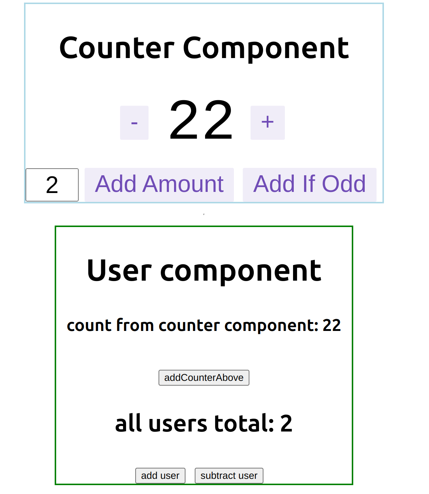

<!-- ABOUT THE PROJECT -->
## About The Project
### Redux for Function component
####  Here a demo to show how two components communicate with each other.
**By use package: react-redux,**
**useSelector(),  useDispatch()**

### That's a screenshot of Redux for $ Function Component $ Demo in React.
<!--  -->


<!-- GETTING STARTED -->
## Getting Started

This is an example of how you may give instructions on setting up your project locally.
To get a local copy up and running follow these simple example steps.

### Installation && Run

This is an example of how to list things you need to use the software and how to install them.
* yarn
  ```sh
  yarn install
  yarn start
  ```


<!-- LICENSE -->
## License

Distributed under the MIT License. 
